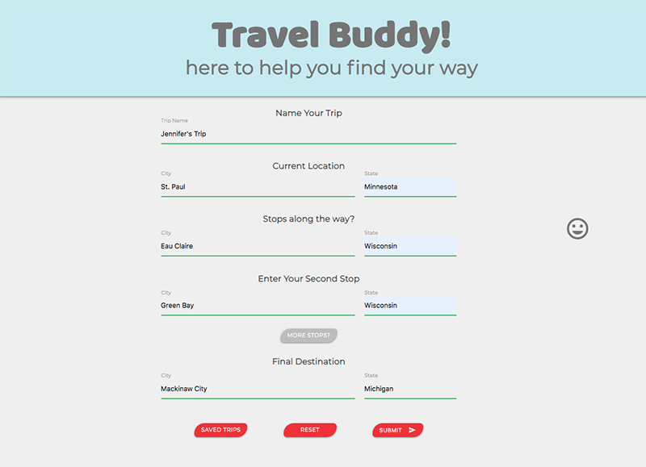
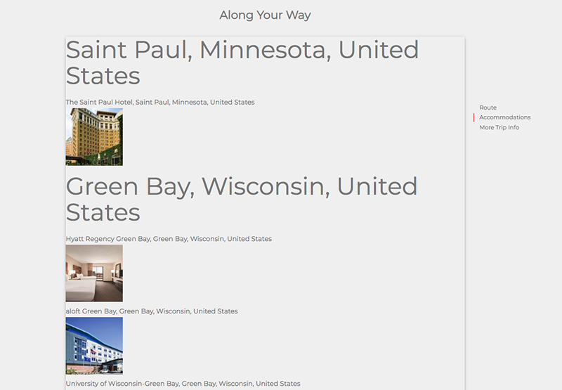
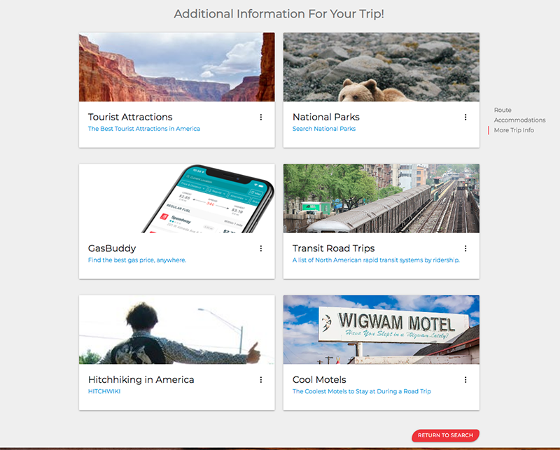

# Travel Buddy
[Travel Buddy](https://wye-oak.herokuapp.com/) is an app to enable the user to plan a road trip with stops along the way.

## Description

Travel Buddy was designed using the It's Tuesday animation library. 

Travel Buddy is a road trip app that allows people to plan their road trip in advance. The user can enter their stops along the way, and then be shown maps of each stop. 

They will also be given hotel information in each of the cities they select. This will enable the user to book their hotels at each city they plan to stop at in advance, ensuring a peaceful road trip.

Travel Buddy also provides helpful links to other road trip apps.

## Motivation

There is a need for people to be able to quickly plan their route of travel and find hotels to compare and select from at each stopping point. 

## Built With

* HTML5
* CSS
* JQuery
* Node
* Express
* MySQL
* Handlebars
* Sequelize
* Materialize
* Google Maps API
* Booking API
* It's Tuesday Animation Library

## Credits

Google Maps API, Booking API
Created by Jean Chapman, Jennifer Faye, Conner Stark & Ziyang Wu 
Date created: 10/29/2019

